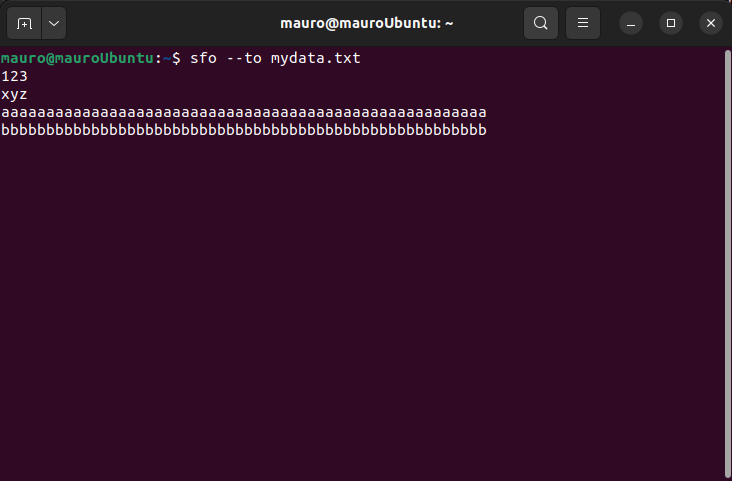

# SFO
## A simple and small file operator for learning purposes

## Arguments

> sfo --from file.txt --to somefolder/anotherfile.txt

Reads raw bytes from `file.txt` and writes them to `anotherfile.txt`

> sfo --from file.txt

Reads raw bytes from `file.txt` and writes them to the standard output print stream.

> echo "$(command-execution.sh) | sfo --to somefile.log

Redirects from standard input to a file

## Best use case: keep a pipe open to continually write stuff into a file

> sfo --to mydata.txt

Opens up a space to leave text that is automatically put into the `mydata.txt` file.

Once the data has been copied to this shell, it will not be lost.

Exit input with Ctrl+D (unix).